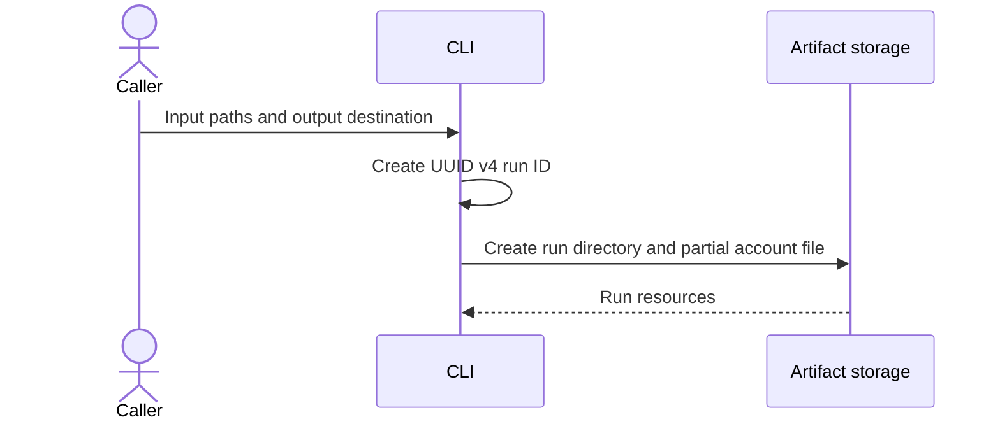
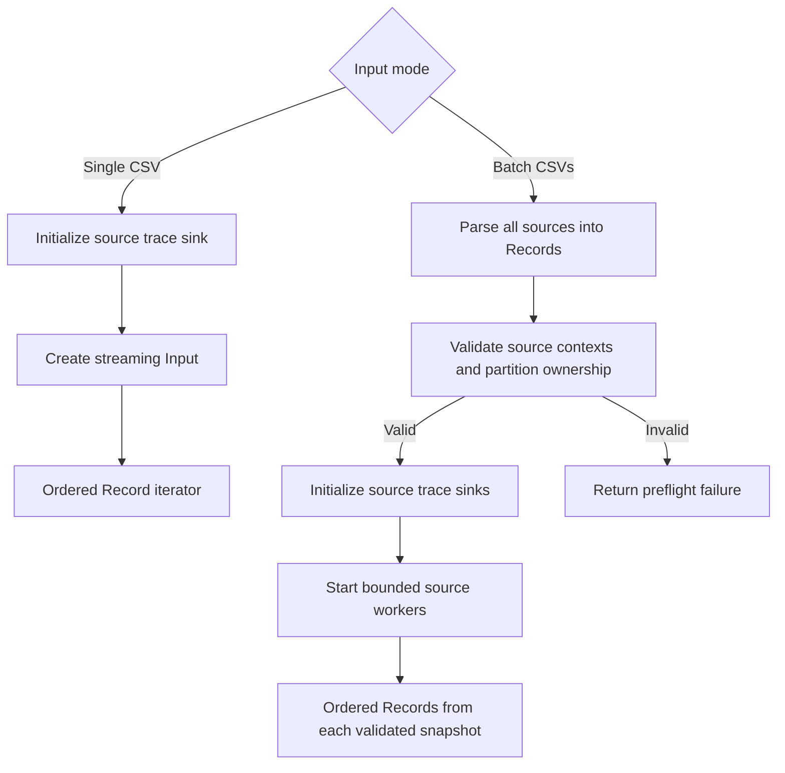
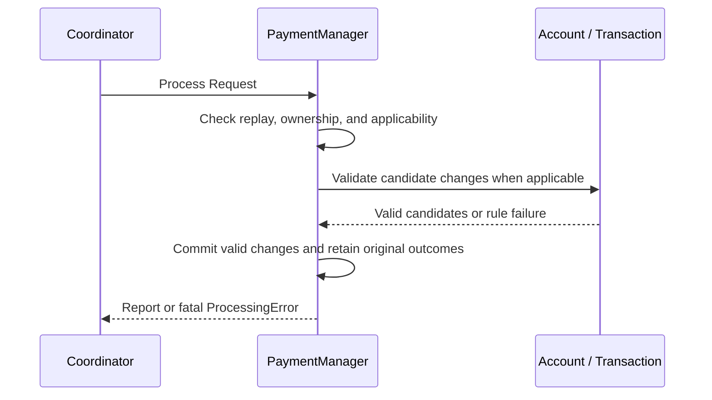
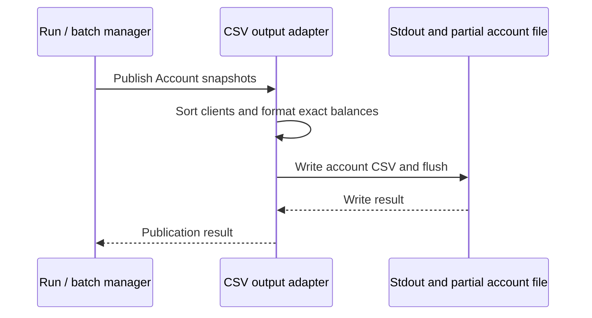
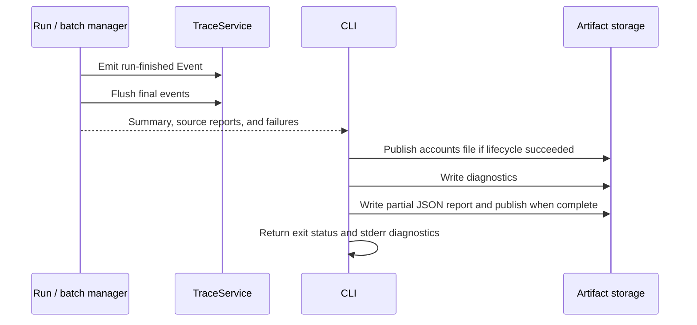

# Payments Engine

## 1. Overview

A Rust library and command-line application for processing user payments from CSV
files. It supports deposits, withdrawals, disputes, resolutions, and chargebacks,
maintaining one account per client with available, held, and total balances.

A single CSV is streamed synchronously. Multiple CSVs are validated together and
processed concurrently when their clients and original transaction IDs are
disjoint. Financial state is isolated per source, and account output is sorted
by numeric client ID.

The implementation separates payment rules, orchestration, and external I/O so
these components can be used within a larger codebase. Shared observability
currently writes structured CSV traces through a generic logging contract.
The observability model is intended to support future monitoring integrations;
the current CSV sink represents the telemetry that integration would receive.

Processing state is in memory for one run. The project does not implement a
network server, durable payment storage, or external observability integrations.
The [implementation plan](docs/implementation-plan.md) records the phased work
and remaining limitations.

## 2. Usage

Run all commands from the crate root, where `Cargo.toml` is located. Install Rust
and Cargo first.

```sh
cargo build --locked
```

### Single CSV

```sh
cargo run -- tests/fixtures/input/payments-a.csv
```

This example exercises deposits, withdrawals, lifecycle actions, locking, a
replay, and intentionally ignored/rejected requests. It produces 10 applied
requests, 1 replay, 2 rejections, and 1 ignored request. Expected account output
is available in [single-accounts.csv](tests/fixtures/expected/single-accounts.csv).

To process your own file and save the resulting account balances:

```sh
cargo run -- transactions.csv > accounts.csv
```

`transactions.csv` is the input file, and shell redirection writes the engine's
account CSV from stdout to `accounts.csv`. Diagnostics stay on stderr. The engine
also creates its separate run artifacts under `output/<run-id>/`. Omit
`> accounts.csv` to display the balances in the terminal.

The input header must contain `type,client,tx,amount`, each exactly once. Columns
can be reordered, and surrounding field whitespace is trimmed. For example:

```csv
type,client,tx,amount
deposit,1,1,5.0000
withdrawal,1,2,1.2500
dispute,1,1,
resolve,1,1,
```

Account output contains `client,available,held,total,locked`, with four decimal
places and lowercase booleans. Stdout contains only account CSV data; run paths
and diagnostics are printed to stderr.

### Batch CSVs

```sh
cargo run -- tests/fixtures/input/payments-a.csv tests/fixtures/input/payments-b.csv
```

The fixtures have disjoint clients and original transaction IDs. Combined counts
are 14 applied requests, 2 replays, 3 rejections, and 2 ignored requests. Expected
account output is [batch-accounts.csv](tests/fixtures/expected/batch-accounts.csv).

All sources are parsed and validated before payment processing. A client or
original transaction ID cannot belong to multiple sources, and lifecycle events
cannot reference an original in another source. Rows retain their order within
each file; there is no ordering guarantee between files. The CLI uses available
CPU parallelism, falling back to one worker. Library callers can set a nonzero
worker limit.

### Run artifacts

Each invocation creates a directory under `output/<run-id>/`. Override the root
with `--output-dir`:

```sh
cargo run -- --output-dir output tests/fixtures/input/payments-a.csv
```

A successful run contains:

```text
output/<run-id>/
    accounts.csv
    report.json
    diagnostics.log
    source-0001.trace.csv
    source-0002.trace.csv    # additional batch source
```

The run ID is a fresh UUID v4. Source IDs are UUID v5 values derived from canonical
input paths, so traces do not expose paths through source IDs. Reports reference
input and artifact filenames rather than absolute paths; stderr and diagnostics
may contain local artifact paths.

Processing/output/trace failures retain `accounts.partial.csv`. Report-writing
failures may retain `report.partial.json`. A later artifact failure can occur
after `accounts.csv` has been published; report filenames reflect the files that
actually exist. Inputs and existing run directories are preserved.

Business rejections and ignored requests do not fail a run. Argument, setup,
parsing, fatal processing, trace, output, and artifact failures produce a nonzero
exit status. See [fixture instructions](tests/fixtures/README.md) for more examples.

## 3. Layout of the project

```text
src/
    domain/
        payment/       # account, money, identifiers, transaction
        observability/ # generic events and severity
        clock.rs       # shared clock contract
    manager/
        payment/       # requests, outcomes, state coordination
            run/       # ordered processing and publication lifecycle
            batch/     # source validation and concurrent execution
            trace/     # payment event mapping
        observability/ # trace delivery contract
    adapters/
        payment/csv/   # row conversion, input, output, provenance, processing
        observability/ # CSV and in-memory trace sinks
        cli/           # arguments and invocation orchestration
        artifacts/     # filesystem operations, identities, JSON reports
        clock.rs       # system clock implementation
    bootstrap/         # thin composition root
    lib.rs             # public library modules
    main.rs            # CLI entry point and exit handling
tests/
    integration.rs     # executable-level integration tests
    fixtures/
        input/         # synthetic CSV inputs
        expected/      # reference account snapshots
scripts/
    generate_payments.py
docs/
    implementation-plan.md
output/                # generated run artifacts, ignored by Git
```

**Domain:** `ClientId` and `TransactionId` wrap `u16` and `u32`. `Money` represents
signed amounts in units of 0.0001 using `i128`; `PositiveAmount` restricts original
payment amounts. `Account` owns balances and locking. `Transaction` owns accepted
original details and lifecycle `State`; its `Type` identifies deposits or
withdrawals. `LifecycleAction` expresses disputes, resolutions, and chargebacks.
Generic `Event`, `Severity`, and `Clock` are shared service concepts.

**Managers:** `PaymentManager` coordinates account and transaction changes and
retains `OriginalRecord` entries. `Request`, `Report`, `Outcome`, and `Reason`
express operations and business results. `SourceContext` and `Context` carry run,
source, and optional partner identity. Run `Coordinator`, `Summary`, `Record`,
`InputFailure`, and `Output` define transport-independent execution boundaries.
Batch `Source` and `ValidatedBatch` establish source isolation before execution.
Shared `TraceService` exposes `emit(Event)` and `flush()` without payment rules.

**Adapters:** CSV `Row` converts into `Request`; `Input`, `Record`, and
`RecordPosition` preserve source provenance. CSV output serializes account
snapshots. `CsvTraceService` and `InMemoryTraceService` deliver generic events,
using an injectable clock. CLI configuration and execution select the concrete
adapters; artifact modules manage files and serialized reports. Future API or
webhook adapters can target the same manager request boundary.

**Bootstrap and binary:** Bootstrap supplies the run identity and connects the
CLI invocation to its adapters. The binary handles process arguments, stderr,
and exit status. Financial execution policy remains in managers.

Implementation modules with unit tests use `mod.rs` and a separate `tests.rs`;
module-specific errors use `error.rs`. Parameterized tests use `rstest`.

### How the entities relate

1. **A row becomes a request.** CSV `Row` is the external representation.
   Conversion creates either an original `Request` with a `PositiveAmount`, or a
   lifecycle `Request` referencing an existing `TransactionId`. The CSV `Record`
   pairs that request with `Context` and `RecordPosition`; metadata does not
   participate in financial rules.
2. **A client owns an account; an original identifies a payment.** `ClientId`
   selects the `Account` containing available funds, held funds, and locking.
   `TransactionId` selects an `OriginalRecord` containing the original request
   and outcome. An accepted original also contains a `Transaction`; a rejected
   original has no accepted transaction. This distinction makes rejected retries
   reproducible without pretending their funds were moved.
3. **The manager coordinates state changes.** `PaymentManager` checks ownership,
   original-ID reuse, and lifecycle applicability. It asks the domain objects to
   validate candidate changes, then commits the account and transaction together.
   Its per-request `Report` contains an `Outcome` and replay flag; `Reason`
   explains an ignored or rejected outcome.
4. **The run coordinates processing and delivery.** `Coordinator` owns a payment
   manager and builds the aggregate `Summary`. It consumes ordered records and
   creates trace `Event` values from their results. `TraceService` delivers those
   events; `Output` publishes account snapshots. The per-request payment report,
   aggregate summary, and external JSON run report serve different purposes.
5. **A batch groups isolated sources.** `Source` contains its context and ordered
   records. `ValidatedBatch` confirms partition ownership before workers start.
   Each source gets its own coordinator, payment state, and trace sink. Aggregate
   reports preserve source order, while account output combines the resulting
   client snapshots.

### Execution in small steps

The engine follows six steps. Steps 3 and 4 repeat for each record. In a batch,
each active source has its own payment manager and trace sink; account publication
waits for all active workers.

#### Step 1: Prepare the run

The CLI creates a run identity and an exclusive artifact directory. Setup failures
stop before any payment is applied.



#### Step 2: Prepare the input

A single file provides an iterator that parses rows as processing advances. A
batch parses and validates every source first, then starts bounded workers. If
batch preflight fails, no payments are applied and no source traces are initialized.



Each `Record` carries a `Request`, source `Context`, and CSV `RecordPosition`.
Batch validation checks disjoint clients and original IDs, and rejects cross-source
lifecycle references. Source setup failures finalize only sinks already initialized.

#### Step 3: Process one request

The payment manager owns the account and original-record maps. Domain operations
validate candidate balances and lifecycle states before the manager commits them.



An identical original replay returns its stored outcome before domain mutations.
Ignored or rejected requests leave balances unchanged, though an unseen client
may receive a zero-balance account. Accepted originals contain a `Transaction`;
rejected originals retain their outcome without an accepted transaction.

#### Step 4: Record the outcome

The coordinator updates its `Summary` and maps the result to a generic `Event`.
CSV provenance is attached by the adapter; the shared trace service delivers it.

```mermaid
sequenceDiagram
    participant Run as Coordinator
    participant Trace as TraceService
    Run->>Run: Count outcome and build Event
    Run->>Trace: Emit Event with source provenance
    Trace-->>Run: Delivery result
    Note over Run,Trace: Repeat for each record; flush after successful processing
    Run->>Trace: Flush request events
```

Business rejections and ignored events continue processing. Input, fatal
processing, and delivery failures stop the source. A failed batch source lets
active peers finish and cancels later groups. Financial operations are never
retried to repair trace delivery.

#### Step 5: Publish account snapshots

Publication begins only if processing and request-trace flushes succeeded. A
batch combines its source snapshots before sorting by client ID.



Processing failures skip this step. Write failures may leave partial output;
bytes already sent to stdout cannot be recalled.

#### Step 6: Finalize traces and artifacts

Both successful and failed runs attempt final summary delivery for every
initialized sink. Summary emission and flushing are attempted independently.



Final trace failures can occur after stdout publication. Later artifact failures
preserve already published accounts and are reflected in the final report when
it can be written. Primary failures are retained alongside secondary errors;
cleanup and reporting do not reprocess payments.

## 4. Assumptions

The following choices resolve business-rule ambiguities and define the current
processing contract.

### One asset account per client

Each client has one account, without currency conversion or an asset identifier.
This follows the single-asset input model. Valid requests mentioning an unseen
client create a zero-balance account, including ignored or rejected requests,
malformed rows and fatal arithmetic failures do not commit new financial state.

### Exact money and positive original amounts

Money uses checked integer arithmetic to avoid floating-point rounding. Deposits
and withdrawals require amounts greater than zero. Integers and up to four
fractional digits are accepted, scientific notation and excess precision are
rejected. IDs accept their complete unsigned ranges, including zero, because the
input contract does not reserve zero. This a
common technique used within several systems (in my current company we do like that as well)

### Withdrawals use available funds

Held funds cannot finance a withdrawal. Insufficient available funds reject the
request without changing balances, preserving the meaning of a dispute hold.

### Only accepted deposits can be disputed

A dispute holds incoming funds credited by a deposit. Withdrawals are rejected
as non-disputable because applying the same hold model to outgoing funds would
require a different financial rule. References to rejected originals are ignored
because those originals never changed balances. Since we do not have clearer rules
on how to proceed with dispute in withdrawals.

### Disputes hold the complete original amount

The stored deposit amount moves from available to held, even if some funds have
already been withdrawn. Available funds may become negative. This preserves the
full disputed liability instead of silently reducing the hold to remaining funds.
Total remains unchanged by disputes and resolutions.

### Lifecycle actions use the stored amount and owner

Dispute, resolve, and chargeback amounts are ignored; the original transaction is
the authoritative source. The client must match its owner, preventing another
client from changing those funds. A mismatch is rejected without financial changes.

### Lifecycle prerequisites are required

Unknown references, repeated disputes, and resolve/chargeback requests without
an active dispute are ignored. Actions after chargeback are also ignored.
Ignoring these inapplicable events keeps their receipt visible without inventing
missing state or repeating a financial movement.

### Chargeback is terminal and locks the account

Chargeback removes the disputed amount from held funds and permanently blocks
new deposits and withdrawals. Existing lifecycle operations remain permitted,
allowing other outstanding disputes to be completed after locking. The charged
back transaction cannot return to posted or disputed state.

### Original transaction IDs identify retries within a run

An identical normalized original request returns its stored outcome without
moving funds again. Different client, type, or amount under the same ID is rejected
as a conflict. Accepted and rejected outcomes reserve IDs, a rejected withdrawal
remains rejected on replay even after later funding. Fatal arithmetic failures do
not reserve the ID because no original was committed. This provides deterministic
retry behavior with the identity present in the input.

### Lifecycle retries follow state rather than an idempotency key

Lifecycle (disputes, resolves and chargebacks) rows have no separate event ID.
Their applicability is determined by the transaction state, so they cannot be fully
distinguished from new identical events. Replay tracking lasts only for the current
in-memory run, restarting the process does not recover earlier state.

For a production-ready system that could be connected to an external partner API, we'd probably
receive some identifier regarding each row so we could create an idempotency strategy for recognizing
duplicated rows better.

### Input order is authoritative

Rows are processed in file order. An unknown reference is ignored immediately,
even if its original appears later, it is not queued for replay. This avoids
reordering partner events or assuming a future row will repair an earlier one.

In a production-ready system, this probably would need adapted to guarantee the processed order such as adding a sequence number on the transaction (a dispute can be received first than its correspondent deposit, for example) so for late arriving transactions we can reconstitute the order of it and process properly.

### Batch files own disjoint partitions

Every mentioned client and original ID belongs to one source, including originals
that may later be rejected. Cross-source lifecycle references are forbidden.
This restriction allows concurrent processing without shared account state or
ambiguous ordering. Unknown references absent from the entire batch remain valid
input and follow the normal ignore rule.

In a real production system this would be probably be discussed further, one approach
I can think of by now is to partition the processing job into several consumers
by client_id or something like that, so we could guarantee that data doesn't mix and we can
preserve joint partitions

### Invalid input stops processing

Malformed headers, fields, CSV data, and reader failures stop the run rather than
skipping rows that might affect later payments. Business rejections and ignored
events continue. Headers are case-sensitive; LF and CRLF endings are supported,
but CR-only endings are outside the contract. Header-only input is valid; an
empty file is rejected. Lifecycle rows may omit the final amount column.

### Synchronous processing within each CSV

Each CSV is processed sequentially using synchronous parsing and financial
operations. Batch mode already provides concurrency between independent files
through bounded OS threads. However, it does not process rows within a file concurrently.
This keeps file ordering explicit and simplifies account ownership, lifecycle
transitions, and failure handling for the current CLI scope.

For a production service handling concurrent imports, API requests, persistence,
and external telemetry, the intended evolution would use an asynchronous runtime
such as Tokio. It could overlap independent I/O waits and coordinate ingestion,
processing, and delivery with bounded queues and backpressure. Financial domain
operations would remain synchronous and retain one ordered owner per client
partition, so a deposit and its dispute cannot race against each other.

## 5. Tests and Robustness

Run the existing checks locally:

```sh
cargo fmt --check
cargo clippy --locked --all-targets -- -D warnings
cargo test --locked --all-targets
cargo test --locked --doc
cargo build --locked --release
```

The current suite has 365 tests: 348 module tests and 17 executable integration
tests. Coverage includes decimal/identifier boundaries, account atomicity,
transaction transitions, ownership, replay/conflict handling, CSV conversion and
output, trace delivery, single/batch execution, preflight isolation, cancellation,
worker failures, and artifact reporting.

LF/CRLF provenance tests cover physical lines, original byte offsets, multiline
quoted fields, invalid input, and split reads. Batch cleanup tests inject failed
worker starts and panicking trace finalization. Artifact tests check preservation
of primary errors and report publication failures. Integration tests exercise the
actual CLI and generated artifacts.

Account and transaction candidates are validated before committing either.
Checked arithmetic detects overflow, and failures preserve earlier financial
state. Account output starts after successful processing and request-trace flush;
processing failures suppress account publication. Output or final trace failures
can still occur after bytes have reached stdout.

A failed batch worker's active peers finish, while later groups are cancelled.
Every initialized sink receives a finalization attempt. Summary emission and
flushing are attempted independently, even if either panics. Primary failures and
additional trace errors are retained; delivery failures never retry payments.

Observability emits applied, ignored, rejected, replayed, input-error,
processing-error, and run-summary events with stable classifications. CSV traces
include record, line, and byte provenance. Payment events omit amounts, balances,
raw rows, and underlying infrastructure error messages. UUID source identities
are deterministic identifiers, not encryption.

Diagnostics are attempted before the final report so their failures are reflected
in the report's overall status and exit code. JSON is written and flushed to a
partial file before publication. Account filenames reflect earlier publication
even when a later artifact failure makes the run fail. Storage failure may prevent
a final report from being created.

### Intended observability integration

`domain/observability` models a shared telemetry contract: structured `Event`
values, severity, correlation, attributes, and timestamped records. It remains
independent of vendor APIs so other services can reuse it and providers can be
added without changing payment rules. Technologies such as Datadog or New Relic
are possible integration targets. `manager/observability` defines delivery through
`TraceService`; a future provider adapter would implement that contract alongside
the current CSV adapter.

Today, the application writes CSV events and JSON summaries. It does not send
logs, metrics, or APM spans to an external provider. The following is the intended production
strategy, rather than functionality already implemented.

#### Structured logging strategy

- Preserve the existing event names: `payment.request_applied`,
  `payment.request_ignored`, `payment.request_rejected`,
  `payment.request_replayed`, `payment.input_failed`,
  `payment.processing_failed`, and `payment.run_finished`. Stable names and
  `reason_code` values support queries across versions and services.
- Record successful operations at Info, business ignores/rejections at Warn,
  and fatal input/processing failures at Error. Replays preserve the severity of
  their original outcome while using a separate event name and replay flag.
- Correlate logs with run/source IDs, optional partner ID, client/transaction
  IDs, and CSV record/line/byte positions where available. Include deployment
  context such as service, environment, and version in the provider adapter.
- Keep amounts, balances, raw payment rows, and infrastructure exception text
  out of payment event attributes. Source identities remain UUIDs; detailed
  delivery diagnostics stay separate from business events.
- Retain failure events and run summaries for investigation. Successful
  per-request logs may be sampled or retained for a shorter period when volume
  grows. Outcome counters must still account for every processed event before
  log sampling, so operational rates remain accurate.
- Buffer and batch telemetry delivery with bounded queues and explicit shutdown
  flushing. Delivery retries would retry telemetry only, never payment requests.
  Delivery failures must remain visible through local diagnostics and separate
  health metrics. This requires new adapter delivery policy; it is not provided
  by the current CSV implementation.

#### Metrics strategy

The service would publish the following aggregates:

- **`payment.requests` — count:** one observation per processed valid request,
  categorized by request type and outcome (`applied`, `ignored`, `rejected`, or
  `replayed`). Replays are counted separately even when their stored outcome was
  applied, preventing retries from appearing as new financial operations.
- **`payment.errors` — count:** fatal input, processing, trace, output, and
  artifact failures, categorized by stage and stable reason. Failures outside
  payment events require instrumentation at their execution boundaries.
- **`payment.runs` — count:** one final overall result per CLI invocation,
  categorized by single/batch mode and completed/failed status. The measurement
  occurs after artifact handling, so it reflects the actual invocation result.
- **`payment.sources` — count:** one processing result per initialized source,
  distinct from the overall batch result. This shows successful peers and
  cancellations within a failed batch.
- **`payment.run.duration` and `payment.source.duration` — distributions:**
  elapsed seconds for a run and source, supporting latency percentiles. Source
  timing and metric emission would need additional instrumentation; the JSON
  report currently records overall elapsed time only.
- **`observability.delivery_errors` and queue depth — count/gauge:** failures
  and pending telemetry in a future buffered provider adapter. These distinguish
  a telemetry outage from payment business-rule failures.

Throughput and rejection, ignore, replay, and fatal-error rates would be derived
from these counters. Request events and run-summary totals describe the same
work; use one counting path per metric rather than adding both. Input errors are
counted separately because malformed rows never become valid requests.

Metric tags would use bounded values such as service, environment, version,
component, execution mode, request type, outcome, stage, and allowlisted reason
codes. Run/source UUIDs, client IDs, transaction IDs, filenames, and error text
remain log attributes rather than metric tags. Partner tags would be enabled
only for a controlled partner set; the current CLI supplies no partner ID.
This keeps metric cardinality bounded rather than creating separate series for
individual payment identities.

#### Investigation and partner feedback

Dashboards would separate business issues from system failures. Business views
would track reasons such as `unknown_transaction`, `client_mismatch`,
`conflicting_transaction_id`, and `insufficient_available_funds`, with their
counts and share of traffic over time. System views would track failed runs,
processing errors, delivery failures, and latency.

Partner discussions would use aggregate reason trends plus correlated examples
from logs: missing references can indicate ordering problems, client mismatches
can indicate ownership mapping errors, and conflicting IDs can indicate retry
identity problems. These are investigation hypotheses, not automatic conclusions.
Changes could then be evaluated against the same rates after a partner adjusts
its input. Operational alerts would focus on fatal failures and sustained
degradation; expected business rejections would use agreed volume/rate thresholds.

For future APM tracing, one root span per run and child spans per source or stage
would show parsing, preflight, processing, publication, and delivery durations.
The adapter would attach actual tracing-provider identifiers to logs for
log/trace correlation.
The existing UUID `correlation_id` remains an application run identity; it is not
an APM trace ID. Per-payment spans would require a separate volume policy.

### Current limits

- Each CSV uses synchronous, ordered processing. Batch files run concurrently
  through OS threads; async ingestion and external I/O orchestration are a future
  production extension, described in the assumptions above.
- Single-file parsing streams rows, but account and transaction history remains
  in memory. Batch preflight buffers all records and opens all inputs; trace
  sinks are initialized upfront. Worker limits do not bound memory or file handles.
- There is no durable state, cross-run idempotency, or atomic commit across stdout,
  account files, traces, and reports. Flush and rename do not guarantee durability.
- CSV processing currently accepts CLI configuration types; further decoupling
  is deferred until another transport is introduced.
- Automated CI and external observability integrations are outside this scope.

## 6. Sample generator script usage

The generator requires Python 3.10+ and only uses the standard library. It creates
synthetic requests whose business transitions should all be applied.

Generate and process a single sample:

```sh
python scripts/generate_payments.py --rows 1000 --seed 42 --output tests/fixtures/input/generated-single.csv
cargo run -- tests/fixtures/input/generated-single.csv
```

Generate disjoint samples for batch processing:

```sh
python scripts/generate_payments.py --rows 1000 --seed 42 --clients 10 --client-start 1 --tx-start 1 --output tests/fixtures/input/generated-a.csv
python scripts/generate_payments.py --rows 1000 --seed 43 --clients 10 --client-start 11 --tx-start 1001 --output tests/fixtures/input/generated-b.csv
cargo run -- tests/fixtures/input/generated-a.csv tests/fixtures/input/generated-b.csv
```

- `--rows`: required number of data rows, excluding the header. Zero produces a
  header-only CSV.
- `--clients`: client pool size; default `10`.
- `--client-start`: first client ID; default `1`.
- `--tx-start`: first original transaction ID; default `1`.
- `--seed`: optional reproducible random seed for the same arguments and Python
  version. Small samples may not include every action type.
- `--output`: create a new CSV; omit it to write to stdout. Existing files are
  preserved, and the destination's parent directory must already exist.

Reserve up to one original transaction ID per requested data row when separating
batch ranges. Lifecycle rows reuse originals only within their own sample. The
script validates ID ranges and keeps at least one client unlocked so it can
produce the requested number of rows. Monetary values use integer units of
0.0001. Generation targets valid transitions; rejection and malformed-input cases
are covered by fixtures and tests.

## 7. Used libraries

Runtime dependencies declared in `Cargo.toml`:

- `csv`: streaming CSV parsing, account output, and trace serialization.
- `serde`: typed serialization for report and trace representations.
- `serde_json`: JSON reports and structured event attributes.
- `time`: timestamp representation and RFC 3339 UTC formatting.
- `uuid`: UUID v4 run identities and UUID v5 source identities.

Development dependency:

- `rstest`: parameterized tests for shared scenarios and boundary cases.

The standard library provides checked integer arithmetic, filesystem I/O,
buffered writing, and scoped worker threads. Python's standard library provides
the sample generator. `Cargo.lock` records resolved Rust dependency versions;
use `--locked` during verification and release builds.
